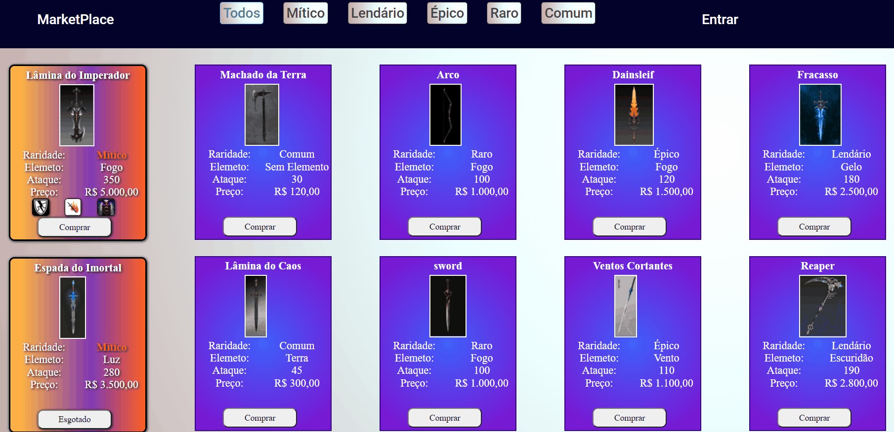
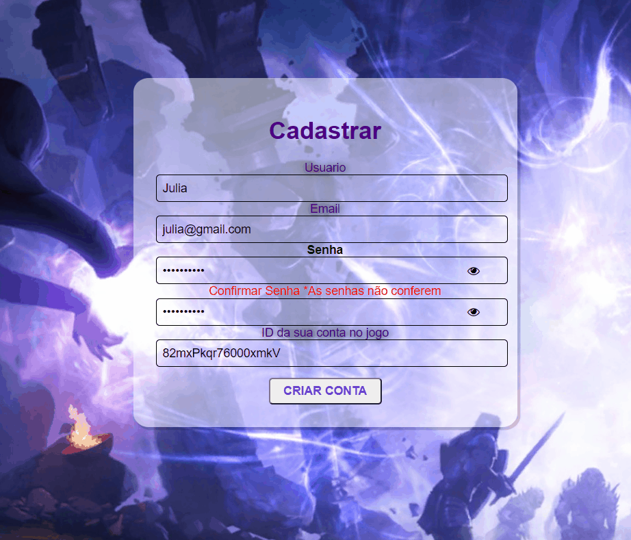

<h1> Site de vendas de itens para jogos</h1>

 Esse projeto foi feito ao termino do primeiro módulo de um curso utilizando apenas Html, CSS e JavaScript sem nunhum tipo de framework. 

<a href="#sobre">Sobre</a> •
<a href="#login">Login</a> •
<a href="#cadastro">Cadastro</a> •
<a href="#tecnologias">Tecnologias</a> •
<a href="#autor">Autor</a>

# Sobre

O usuário vincula sua conta do jogo na hora do cadastro através do seu ID, assim cada item que ele compra, uma cópia é enviada automaticamente para o seu inventário no jogo.

Ao tentar comprar sem estar logado, um modal é exibido com 2 botões redirecionando o usuário para criar uma conta ou para fazer o login

 
 

# Cadastro

Através do ID na hora do cadastro o usuário linka sua conta no jogo com o marketplace.

 
 

# Login

Após o cadastro o usuário efetua o login e a página principal recebe o usuário e mostra quanto de valor em dinheiro que ele tem, aqui para o exemplo eu deixei um valor predefinido.

 
 

# Tecnologias

• <a href="#">Html</a>
 

• <a href="#">CSS</a> 
 

• <a href="#">JavaScript</a> 
 

# Autor

Nalbert de Jesus 

